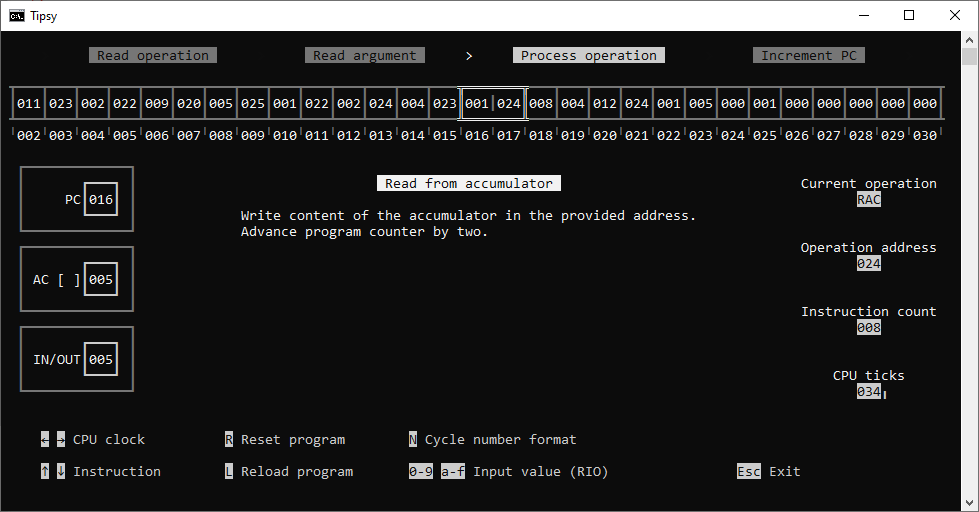

This solution contains a *usable* [^1] WPF project, but the primary project is Tipsy.  
**Important for first time users**: Tipsy has a somewhat unusal input method for its I/O register.
While the 'IN' is active, any digit (or hexadecimal letter) you type is added to it after shifting the previous value.

# Tipsy
Tipsy is a console based program that emulates and visualizes a fictional CPU. 

##  Usage
    Tipsy <program-file> [-comp] [-output <output-file>] [-input <input-file>]

### Optional arguments
**-comp**  
Generate output files for each stage of 'compilation' when starting or reloading.  
The generated files are named based on the provided file.  
Existing files are overwritten.
                                    
**-output**  
Whenever the I/O register triggers an 'OUT',  
the value will be appended as a new line to 'output-file'.
                                    
**-input**  
Whenever the I/O register triggers an 'IN',  
a single line will be read from 'input-file', starting at the top.  
When all lines are read, reading will start again at the top.  

---

## Assembly
Operations can be written as a decimal number or a 3 letter short:  

>ADD  
10

or

>4  
10

If an operations requires an address, it can be written on the same line, separated by a single space:
    
>ADD  
10

or

>ADD 10    

`/` Starts a comment until the end of the line.  
`#` References a named address, e.g. `#sum` or `#add`.  
`:` Adds a name to an address, e.g. `0:sum` or `ADD:add`.  
   A line with a name but without value defaults to 0, e.g. `:i` is treated as `0:i`.

                        
Example program:

>/Code  
WAC #a  
ADD #b  
RAC #sum  
/Values  
5:a  
10:b  
\:sum

---

## Higher level syntax

### define
    define <name=value>|<name> [, <name=value>|<name>]

Generates a block of named values. If only a name is provided, they default to 0.  
Example:

>define a, b=1, c

### set
    set <named address> to <named address>|<number> [(+|-|<|>) <named address>|<number>]      
Changes the value of a specific address.  
The new value can be copied from another address or a constant.  
Optionally the new value can be achieved through an operation involving a third address or constant (Bitshift only supports constants).  
Examples:

>set a to b  
set a to b < 2  
set a to a + b

### skip
     skip if|unless flag|(\<named address> is zero)  
        [\<code>]  
     end of skip

A skip block can either execute or skip a section of code (indentation is ignored).  
The condition can be inverted and depends on a value being equal to 0 or the AC flag being set.
Example:
>skip if a is zero  
set b to a < 1  
end of skip

### repeat
    repeat until|while flag|(<named address> is zero)
        [<code>]
    end of repeat
    
A repeat block can repeat a section of code (indentation is ignored).  
The condition can be inverted and depends on a value being equal to 0 or the AC flag being set.
Example:
>repeat until flag  
set b to b - c  
end of repeat
                        
### function
    function <name>
        [<code>]
    end of function

A block of code that is given a name to 'call' it repeatedly from different locations in the program (indentation is ignored).  
Example:
>function shiftAdd  
set a to a < 1  
set a to a + 1  
end of function
                        
### call       
    call <name>

Jumps to the location of a function which will jump back to this location when finished.  
Example:
>5:a  
call shiftAdd

## Instruction set

### 00 | NOP - No operation
Advance program counter by one.

### 01 | RAC - Read from accumulator
Write content of the accumulator in the provided address.  
Advance program counter by two.

### 02 | WAC - Write to accumulator
Write content of the provided address to the accumulator  
Advance program counter by two.

### 03 | SWP - Swap
Swap contents of accumulator and program counter.

### 04 | ADD - Add
Add content of provided address to the accumulator.  
Set ALU flag in case of overflow, otherwise reset it.  
Advance program counter by two.

### 05 | SUB - Subtract
Subtract content of provided address from the accumulator.  
Set ALU flag in case of underflow, otherwise reset it.  
Advance program counter by two.

### 06 | BSL - Bit shift left
Shift bits of the accumulator to the left by one.  
Set ALU flag to the bit that was moved out.  
Advance program counter by one.

### 07 | BSR - Bit shift right
Shift bits of the accumulator to the right by one.  
Set ALU flag to the bit that was moved out.  
Advance program counter by one.

### 08 | JMP - Jump
Set program counter to the provided value.

### 09 | JPZ - Jump if zero
If content of accumulator equals zero, set the program counter to the provided value.  
Otherwise, advance program counter by two.

### 10 | JPF - Jump if flag
If ALU flag is set, set the program counter to the provided value.  
Otherwise, advance program counter by two.

### 11 | RIO - Read from I/O
Write the current content of the I/O register into the provided address.  
Advance program counter by two.

### 12 | WIO - Write to I/O
Write the content of the provided address into the I/O register.  
Advance program counter by two.

[^1]: You can use it if you want, but it's very much just a "works for me for this one thing" project. It also uses AvalonEdit, so pay attention to their license if you want to use it!